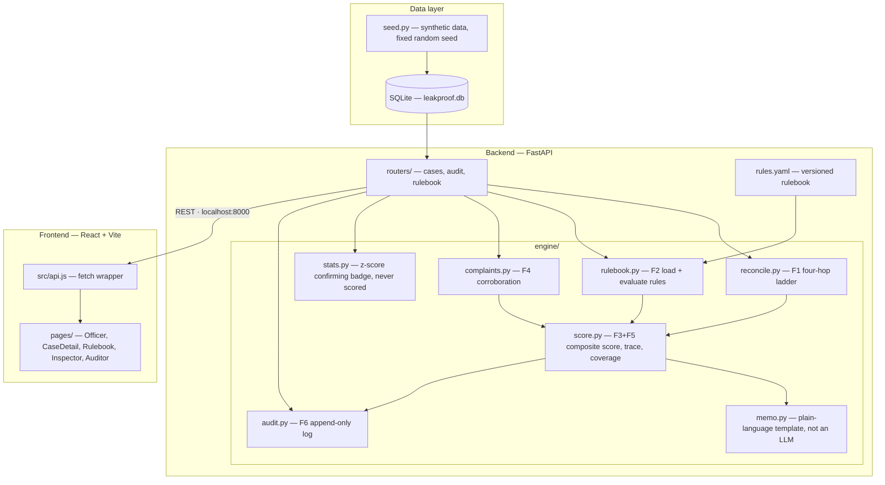

# LEAKPROOF

### AI-Based Public Distribution System Diversion Detection

Explainable diversion detection for India's Public Distribution System.

Built for **PS-B16**, Innovate 4 Impact: AI SDG Global Hackathon 2026, by team **ExploreeTinkerBell**.

## The problem

India's Public Distribution System moves subsidised foodgrain to roughly
two-thirds of the population under the National Food Security Act. It
moves through a chain: government allocation → transport consignment →
fair-price shop receipt → beneficiary transaction at an ePoS counter.
Grain leaks between those hops. Today the mismatch surfaces months later
in an audit, by which time the trail is cold, and inspections are
allocated by rotation rather than by evidence.

## The solution

LEAKPROOF reads data the PDS already produces — ePoS-linked weighing
scales, FCI depot weighbridges, vehicle GPS, and public grievance portals
— and reconciles four numbers per cycle. Where they disagree, it
localises **which hop** the grain left at, scores the case against a
rulebook an officer can edit, and emits a reasoning trace that survives
scrutiny in front of a magistrate.

LEAKPROOF installs no hardware. It reads existing infrastructure.

## Users and roles

| Role | What they see |
|---|---|
| **Officer** | Ranked case list, opens a case, reads the reasoning trace |
| **Inspector** | Cases ordered by score for field visits, adds notes |
| **Auditor** | The append-only audit trail, presses Recompute |

Roles are a dropdown switcher in this build. Real authentication is out of scope — see Declared Limitations.

## Six features

| # | Feature | What it does |
|---|---|---|
| F1 | Four-hop reconciliation ladder | Locates which hop (dispatch→receipt or receipt→counter) the grain disappeared at |
| F2 | Versioned YAML rulebook | An officer edits detection thresholds without a developer or a deploy |
| F3 | Reasoning trace | Every rule, its raw value, its threshold, and its contribution to the score — nothing is a black box |
| F4 | Complaint auto-linking | Public grievances within a 14-day window corroborate a case automatically |
| F5 | Graceful degradation | Missing data (e.g. no GPS feed) is scored as "couldn't check," never silently as "passed" |
| F6 | Append-only audit trail | Every score is re-derivable from stored inputs, months later |

## The four-hop reconciliation model

```
allocated_kg → dispatched_kg → weighed_kg → dispensed_kg
```

Three variances, three places grain can go missing:

- **allocated → dispatched** — paper diversion at the depot
- **dispatched → weighed** — transport-leg diversion
- **weighed → dispensed** — counter skimming at the shop

The system doesn't just flag a shop as suspicious — it names which leg of the journey the grain disappeared on.

## Architecture



Everything runs on localhost. No Docker, no cloud dependency, no external API calls — deliberate, so nothing can fail on venue wifi.

## Tech stack

| Layer | Technology |
|---|---|
| Backend | Python 3.11, FastAPI, SQLAlchemy, SQLite, PyYAML, pytest |
| Frontend | React, Vite, Tailwind CSS, React Router |
| Data | SQLite (single file, committed as a rollback artifact) |
| Dev tooling | Claude Code (VS Code) |

## Repository structure

```
.
├── backend/
│   ├── app/
│   │   ├── main.py              FastAPI app, CORS, router registration
│   │   ├── db.py                SQLAlchemy engine + session
│   │   ├── models.py            9 SQLAlchemy tables
│   │   ├── schemas.py           Pydantic shapes — mirrors the frozen contract
│   │   ├── rules.yaml           F2 rulebook, loaded at runtime
│   │   ├── engine/
│   │   │   ├── reconcile.py     F1 — four-hop ladder, gap localisation
│   │   │   ├── rulebook.py      F2 — load + evaluate rules
│   │   │   ├── score.py         F3 + F5 — composite score, trace, coverage
│   │   │   ├── complaints.py    F4 — window matching, corroboration bonus
│   │   │   ├── stats.py         z-score confirming badge (never scored)
│   │   │   ├── audit.py         F6 — append-only event log
│   │   │   └── memo.py          Plain-language template, not an LLM
│   │   └── routers/
│   │       ├── cases.py         /api/cases, /api/cases/{id}, notes, recompute
│   │       ├── audit.py         /api/audit/{case_id}
│   │       └── rulebook.py      /api/rulebook
│   ├── seed.py                  Synthetic data, fixed random seed
│   ├── requirements.txt
│   └── tests/                   pytest suite, fixture-driven
├── frontend/
│   └── src/
│       ├── api.js               Single fetch wrapper
│       ├── ui.js                Shared design tokens (card, button, field…)
│       ├── severity.js          Severity/status style maps
│       ├── hooks/
│       │   └── useApi.js        Shared data-fetching hook
│       ├── components/
│       │   ├── PageHeader.jsx
│       │   ├── Sidebar.jsx / TopBar.jsx
│       │   ├── Tag.jsx          Rectangular status/severity tag
│       │   ├── Skeleton.jsx / EmptyState.jsx
│       │   └── Ladder.jsx / TraceTable.jsx
│       └── pages/
│           ├── Officer.jsx
│           ├── CaseDetail.jsx
│           ├── Rulebook.jsx
│           ├── Inspector.jsx
│           ├── Auditor.jsx
│           └── NotFound.jsx
├── docs/
│   ├── contract/
│   │   ├── case_detail.json     Frozen API contract — single source of truth
│   │   └── fixtures.md          Three-shop fixture table (#4521/#4102/#4788)
│   └── design/
│       └── REDESIGN-SPEC.md     Locked design tokens and UI conventions
├── CLAUDE.md                    Conventions and invariants for AI-assisted dev
├── PROJECT-BRIEF.md             Full project scope and scoring spec
└── README.md
```

## Onboarding — new contributor setup

Run these in order from a fresh clone. Two terminals needed — one for backend, one for frontend.

**1. Check prerequisites**
```bash
python --version     # expect 3.11.x
node --version        # expect v20.x
git --version
```

**2. Clone the repo**
```bash
git clone https://github.com/YOUR-USERNAME/AI-Based-Public-Distribution-System-Diversion-Detection.git
cd AI-Based-Public-Distribution-System-Diversion-Detection
```

**3. Backend setup (terminal 1)**
```bash
cd backend
python -m venv .venv
source .venv/bin/activate      # Windows: .venv\Scripts\activate
pip install -r requirements.txt
python seed.py                 # creates leakproof.db, seeds 60 shops
uvicorn app.main:app --reload --port 8000
```
Confirm it's up: open `http://localhost:8000/health` in a browser — expect `{"status":"ok"}`.

**4. Frontend setup (terminal 2, separate window)**
```bash
cd frontend
npm install
npm run dev
```
Confirm it's up: open `http://localhost:5173` — expect the Officer page with a ranked case list.

**5. Run the test suite**
```bash
cd backend
pytest -v
```
All tests should pass. Fixture assertions check exact scores for shops #4521 (87/HIGH), #4102 (55/MEDIUM), and #4788 (53/MEDIUM) — these numbers are load-bearing and documented in `docs/contract/fixtures.md`.

**6. Read before touching code**
Read `CLAUDE.md` and `PROJECT-BRIEF.md` in full before making changes — they document the invariants (fixed scores, append-only audit trail, rulebook weight totals) that the test suite and the pitch both depend on.

## Scoring

Rule weights live in `backend/app/rules.yaml`, loaded at runtime — editable without a code change or redeploy.

| Rule | Condition | Weight |
|---|---|---|
| Weighing variance | dispatch→receipt shortfall beyond tolerance | 30 |
| Delivery gap | delivery-to-dispatch gap exceeded | 25 |
| GPS deviation | vehicle deviated from registered route | 22 |
| Counter variance | receipt→counter shortfall beyond tolerance | 20 |
| Transaction mismatch | transactions inconsistent with ration-card count | 15 |
| Operating hours | irregular shop operating hours | 8 |
| Complaint corroboration | ≥3 complaints in a 14-day window | +10 |

Total possible: 130, displayed capped at 100. Severity bands: HIGH ≥ 75, MEDIUM ≥ 50, else LOW.

A rule whose input is unavailable is marked **skipped**, not passed — it contributes zero and reduces the case's signal-coverage percentage. This is deliberate: "we checked and it was fine" and "we couldn't check" are different claims, and conflating them is how audit systems lose credibility.

## Declared limitations

Stated proactively, not discovered as gaps:

1. Data is synthetic, generated under a fixed random seed for reproducibility
2. Rule weights are back-solved for the demo fixtures, not learned from real data
3. Escalation is a stub — no email or SMS is actually sent
4. Roles (Officer / Inspector / Auditor) are a dropdown switcher, not real authentication
5. Inspector routing is score-sorted, not geographically optimised
6. Memos are template-generated, explicitly labelled as such — not produced by a language model
7. Headline statistics referenced in the pitch are illustrative, not sourced

## Team

**ExploreeTinkerBell**
- Nidhi Dhyani — backend, detection engine
- Saumya Singh — frontend, integration
  
