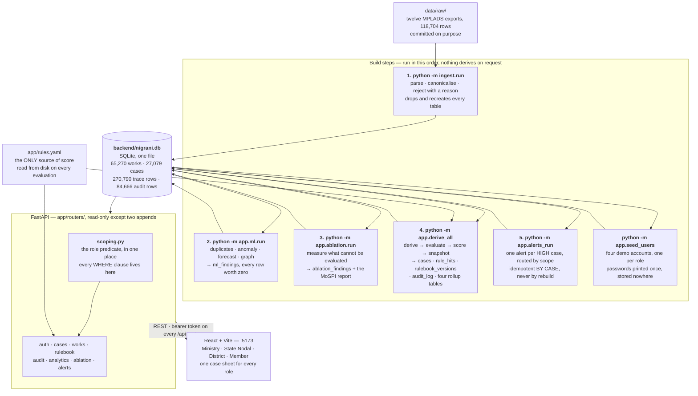
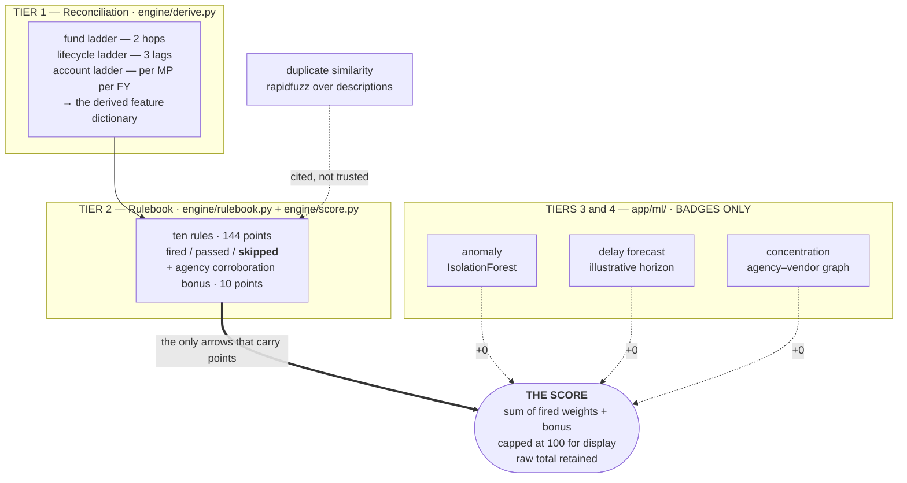

# ARCHITECTURE — NIGRANI

How data moves from the twelve committed MPLADS exports to a case sheet an
officer reads, and where the boundary sits that keeps a model from touching a
score.

Two diagrams. The first is the pipeline; the second is the four-tier boundary,
which is the claim the product is actually built on and the one a judge will
push hardest.

---

## 1. The pipeline

Everything runs on localhost. Five build steps write the database; the API only
reads it.



**Why the build steps are steps and not request handlers.** The API derives
nothing. A clone that runs `ingest.run` and then `uvicorn` gets a working server
with zero cases, which is the most misleading screen the product can show — so
`/health` reports `awaiting_build` rather than `ok` for exactly that reason. A
full rebuild takes under two minutes and is deterministic: two runs from an
empty database produce identical scores, identical coverage and an identical
audit hash chain.

**Why `rules.yaml` reaches two places.** `derive_all` snapshots it into
`rulebook_versions` at build time, and the API reads it from disk per request so
an officer's edit takes effect without a restart. Those are different jobs: a
case is scored under the snapshot it carries, and `GET /api/rulebook` reports
`file_matches_stored_version: false` when the file has moved on.

---

## 2. The four-tier boundary — exactly one tier can move a score

This is the structural claim. It is enforced by tests that walk the source, not
by convention.



Read the arrows. **Only the double arrow carries points.** The three dotted
arrows from tiers 3 and 4 are drawn because those findings do reach the case
sheet — they are rendered on it, as badges — and each one contributes exactly
zero. A test per model perturbs the model's output and asserts the stored score
is byte-identical.

### The one apparent exception, stated plainly

`duplicate_work` is a **tier-2 rule that reads a number a similarity model
produced**, and it does contribute 18 points. It is admissible because the trace
row **cites its evidence**: the matched work ids, the shared description text,
the similarity components and the method. The officer opens both works and
judges for themselves. That is explainability by citation, not by trust — and it
is why the citation renders inside the trace row rather than in a section of its
own.

### How the boundary is enforced

`tests/test_ml_boundary.py` walks the abstract syntax tree of every file in
`app/engine/` and every file in `app/ml/` and asserts the import graph one
direction at a time:

- nothing in `app/engine/` may import from `app/ml/`
- nothing in `app/engine/` or `app/ml/` may import from `app/ablation/`
- the scoring path cannot reach a model output except through the cited
  duplicate field

A diagram can be redrawn to say anything. The AST walk cannot: if somebody
imports the anomaly scorer into `score.py`, the test fails on the import, before
any number moves.

---

## 3. Where each invariant is enforced

The twelve invariants in `CLAUDE.md` are not comments. Each has a place in the
pipeline where it becomes true and a test that keeps it true.

| # | Invariant | Enforced at | By |
| --- | --- | --- | --- |
| 1 | The score comes only from the rulebook | tiers 3–4 boundary | `test_ml_boundary.py` AST walk + a perturbation test per model |
| 2 | Missing data is `skipped`, never `passed` | `engine/rulebook.py` | a `None` with no recorded availability raises rather than defaulting |
| 3 | Every declared hop and lag is computed | `engine/derive.py` | a derivation function and a test per hop and lag |
| 4 | `audit_log` is append-only | everywhere in `backend/` | a grep across every backend source file, not just the audit module |
| 5 | Recompute re-derives against the snapshot | `engine/audit.py` | the snapshot comes from `cases.rulebook_version_id`, never from disk |
| 6 | Thresholds come from measured distributions | `app/rules.yaml` | every threshold carries its firing count as a comment |
| 7 | Constants appear once | `app/constants.py` | no duplicated literal across ingest, engine and derive |
| 8 | Case ids are deterministic from the work id | `ingest/` | a rebuild reproduces every case id, asserted by the idempotence test |
| 9 | Schema and contract move together | `schemas.py` ↔ `case_detail.json` | the contract test reads the frozen file |
| 10 | Role scoping is enforced in the query | `routers/scoping.py` | tested through HTTP *and* against the compiled SQL |
| 11 | Ingestion never silently drops a row | `ingest/run.py` | `loaded + rejected == rows` per file, asserted by the run itself |
| 12 | Synthetic rows are labelled | every table with a control row | excluded from every published aggregate, labelled on screen |

---

## 4. Request path for one case sheet

What actually happens when an officer clicks a row.

```
browser  GET /api/cases/NG-094E347D96
             Authorization: Bearer <jwt>
                │
                ▼
   auth.get_current_user      decode the token, load the users row
                │             (role and scope are read from the ROW,
                │              never from the token's claims)
                ▼
   scoping.scoped_cases(user) build the select, add the role predicate
                │             ministry     → no predicate
                │             state_nodal  → state_id == S
                │             district     → state_id == S AND district == D
                │             member       → mp_id == M
                ▼
   cases._case_or_404         one row through that select
                │             not in scope → 404, never 403: a 403 would
                │             confirm another district's case id is real
                ▼
   build_case_detail          ladders re-derived · trace read from rule_hits
                │             · badges read from ml_findings · memo templated
                ▼
   CaseDetail (schemas.py)    the frozen shape in docs/contract/case_detail.json
                │
                ▼
   the case sheet             score · both ladders · ten trace rows with their
                              citations inline · the corroboration bonus ·
                              three badges each printing +0 · coverage ·
                              the memo · notes and recompute
```

The predicate is applied **before** the row leaves the database. Filtering
after `.all()` would be scoping in the application, and the row would already
have been fetched — which is the failure invariant 10 names, and one a
response-body test alone would not catch.
